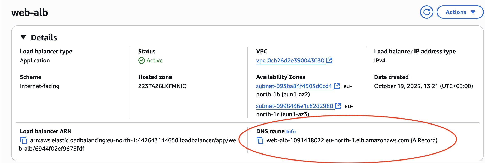
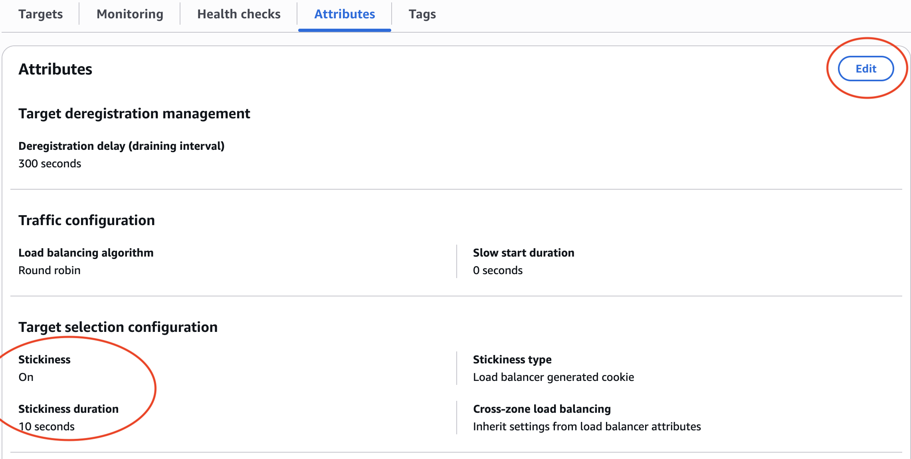
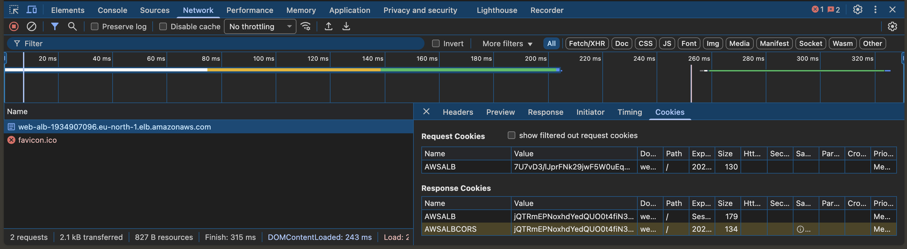

# aws-ec2-elb-example

This repo was opened for 'How to design a basic application load balancer with aws ec2 instances?'

## Prerequisites

- Terraform
- AWS CLI
- AWS Account

## How to run

```bash
git clone https://github.com/bedoodev/aws-ec2-elb-example.git
cd aws-ec2-elb-example/tf
terraform init
terraform apply
```

> You can run `terraform plan` after `terraform init` to see what will be created.

> Terraform apply will create 4 ec2 instances and 1 application load balancer.

> If you are in different region, please change the region, ami, and instance type in main.tf file.

### After running terraform apply

- Go to AWS Console
- Go to EC2 Service
- Go to Load Balancers

- Copy the Load Balancer DNS Name

  

- Open the browser and paste the Load Balancer DNS Name
- You should see the load balancer is distributing the traffic to the ec2 instances with round-robin attribute.

#### Sticky Session

- Go to EC2 Service
- Go to Target Groups
- Select the Target Group
- Go to Attributes
- Go to Edit and Enable Sticky Session
- Go to Target selection configuration
- Select 'Turn on stickiness' and 10 seconds
- Save changes and wait for a few seconds to apply the changes
- Open the browser and paste the Load Balancer DNS Name
- You should see the load balancer is distributing the traffic to the ec2 instances with sticky session attribute.

    

- Go to inspect element and go to network tab
- Refresh the page and you should see the cookies are set

    

## Destroy

```bash
terraform destroy
```

- You should see the ec2 instances and load balancer are deleted.
